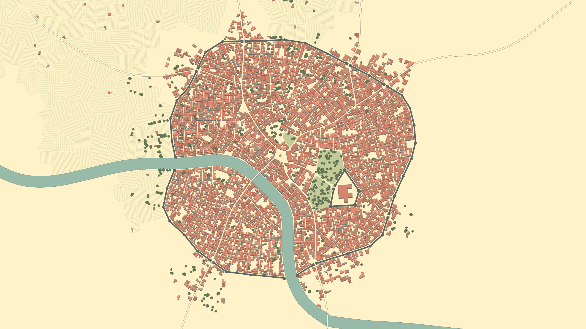

# Blühender Fjord

Die farbenfrohe Region im Westen Hals...

## Frelia

Eine bunte Metropole, in der nach Wissen und Ästhetik gestrebt wird. Die vielen botanische Gärten und die Blumenzucht
wurde von dem Vater von Kurfürstin Solenne in Auftrag gegeben, um seine Gattin glücklich zu machen. Dadurch hat sich
Frelia und auch Hal neben der Großen Bibliothek einen Namen in Faergria gemacht.

<procedure title="Charaktere von diesem Ort">
<list columns="3">
<!-- <li></li> -->
<!-- <li></li> -->
<!-- <li></li> -->
<li></li>
</list>
</procedure>

### Blütenschloss Frelia {collapsible="true" default-state="expanded"}

Der Grundriss der Schlossanlage ist angelehnt an eine Blüte. Die vielen Grünflächen und Gärten stehen unter strengster
Obhut von Kurfürstin Solenne.

<procedure title="Charaktere von diesem Ort">
<list columns="3">
<li>Kurfürstin Solenne von Hal</li>
<li></li>
<!-- <li></li> -->
</list>
</procedure>

<!--
## Magieakademie von Hal {collapsible="true" default-state="expanded"}

<procedure title="Charaktere von diesem Ort">
<list columns="3">
<li></li>
</list>
</procedure>
-->

### Große Bibliothek von Hal {collapsible="true" default-state="expanded"}

Die hohen Regale der Bibliothek enthalten äonenaltes Wissen aus der gesamten Welt. Eine sonderbare Frau hütet die alten
Wälzer wie ihre eigenen Kinder; und das seit die Bibliothek erbaut wurde. Die Bibliothek steht in direkter Verbindung
zur Magieakademie von Hal, daher treiben sich gerade zur Klausurenphase viele Akademiestudenten in den weitläufigen
Gängen herum.

<procedure title="Charaktere von diesem Ort">
<list columns="3">
<li></li>
<!-- <li></li> -->
</list>
</procedure>
