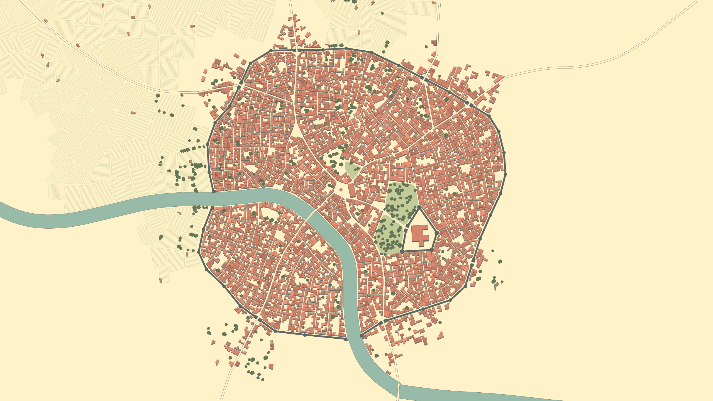

# Blühender Fjord

Die farbenfrohe Region im Westen Hals...

## Frelia

Eine bunte Metropole, in der nach Wissen und Ästhetik gestrebt wird. Die vielen botanische Gärten und die Blumenzucht
wurde von dem Vater von Kurfürstin Solenne in Auftrag gegeben, um seine Gattin glücklich zu machen. Dadurch hat sich
Frelia und auch Hal neben der Großen Bibliothek einen Namen in Faergria gemacht.

<table>
<tr><td>Name und Beschreibung</td><td width="300">Portrait</td></tr>
<!--<tr><td><h4>Frille</h4> Adlige aus der Stadt Stea Brye, Hauptstadt von Mesmudor im Königreich Kradian.</td><td width="300"></td></tr>-->
<!--<tr><td><h4>Ignaz Doisneau</h4> Alchemist, bekannt für seine Fähigkeiten.</td><td width="300"></td></tr>-->
<!--<tr><td><h4>Julianne</h4> Tavernenbesitzerin in Frelia, bekannt für ihre alkoholischen Mischgetränke.</td><td width="300"></td></tr>-->
<tr><td><h4>Linet</h4> Fahrende Händlerin, reist durch Faergria und verkauft Waren, wird oft beklaut.</td><td width="300"></td></tr>
</table>

### Blütenschloss Frelia {collapsible="true" default-state="expanded"}

Der Grundriss der Schlossanlage ist angelehnt an eine Blüte. Die vielen Grünflächen und Gärten stehen unter strengster
Obhut von Kurfürstin Solenne.

<table>
<tr><td>Name und Beschreibung</td><td width="300">Portrait</td></tr>
<tr><td><h4>Kurfürstin Solenne von Hal</h4> Regierende Kurfürstin von Hal.</td><td width="300"></td></tr>
<tr><td><h4>Prinzessin Sonya von Hal</h4> Assasinin in Grenbrock, Tochter von Solenne.</td><td width="300"></td></tr>
<tr><td><h4>Marine Courbet</h4> Leibgarde der Kurfürstin Solenne.</td><td width="300"></td></tr>
</table>

<!--
## Magieakademie von Hal {collapsible="true" default-state="expanded"}

<table>
<tr><td>Name und Beschreibung</td><td width="300">Portrait</td></tr>
<tr><td><h4>Theodoric</h4> Chef der Magierpolizei in Hal.</td><td width="300"></td></tr>
</table>
-->

### Große Bibliothek von Hal {collapsible="true" default-state="expanded"}

Die hohen Regale der Bibliothek enthalten äonenaltes Wissen aus der gesamten Welt. Eine sonderbare Frau hütet die alten
Wälzer wie ihre eigenen Kinder; und das seit die Bibliothek erbaut wurde. Die Bibliothek steht in direkter Verbindung
zur Magieakademie von Hal, daher treiben sich gerade zur Klausurenphase viele Akademiestudenten in den weitläufigen
Gängen herum.

<table>
<tr><td>Name und Beschreibung</td><td width="300">Portrait</td></tr>
<tr><td><h4>Seloue</h4> Hohefürstin des Wissens.</td><td></td></tr>
<tr><td><h4>U-Ranos</h4> Vergreisender, überreifer umherstreifender Knecht Justicias.</td><td width="300"></td></tr>
<!--<tr><td><h4>Lavande Violette</h4> Bibliothekarin, bewahrt Wissen in Hal auf.</td><td width="300"></td></tr>-->
</table>